# Feature Context Builder 技術設計書

## 1. この文書について

この文書は、Feature Context Builderの技術構成を、初めてプロジェクトを見る人にも分かる形で説明します。対象は、機能を追加・修正する開発者、セキュリティレビュー担当者、技術選定の理由を知りたいプロダクト関係者です。

本書では、次の3点を中心に扱います。

- アーキテクチャと技術の選定理由
- モジュール間の依存関係とデータの流れ
- 各モジュールが外部へ公開するインターフェース（IF）

### 1.1 用語

| 用語 | この文書での意味 |
|---|---|
| core | AIの種類や画面に依存しない、安全確認・コード収集・成果物生成のルール |
| application | 「新しく調査する」「AIなしで再構築する」といった利用者の目的を実行する層 |
| adapter | Gemini、Codex、Windows、HTTPなど、外部の違いを共通IFへ変換する部品 |
| registry | AIのIDから対応するadapterを選ぶ登録簿 |
| Port | applicationが外部機能を呼ぶためのIF。実装をテスト用に交換できる |
| DTO | PC画面とmain process、またはスマホとGatewayの間で受け渡すデータ |
| bundle | ブラウザAIでの仕様検討と、開発エージェントへの引き渡しに再利用する最大5件のMarkdown |
| manifest | 調査・検証・自動収録・成果物の情報を保存する内部管理用JSON |

## 2. 全体像

Feature Context Builderは、PC GUI、スマホGUI、CLIという3つの入口から、同じ調査・検証・梱包処理を利用するローカルファーストのアプリケーションです。

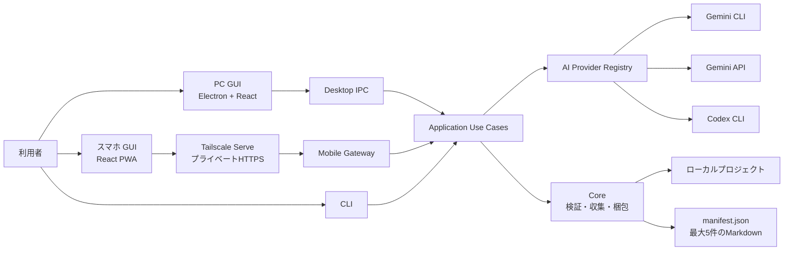

重要なのは、GUI、スマホ、CLIが別々の生成処理を持たないことです。どの入口から実行しても、関連パスの検証、秘密情報の除外、実ファイルの収集、最大5件への梱包は同じcoreを通ります。

## 3. アーキテクチャの選定理由

### 3.1 Electron + React + TypeScript + Vite

| 選定 | 理由 | 受け入れたトレードオフ |
|---|---|---|
| Electron | Node.jsのファイル操作、子プロセス、Windowsのフォルダ選択、暗号化保存、タスクトレイを1つのアプリから利用できる | ネイティブ専用実装より配布サイズとメモリ使用量が大きい |
| React | 入力、進捗、自動選定結果、スマホ設定の状態変化をコンポーネントとして整理しやすい | 小さな静的画面より構成要素が増える |
| TypeScript | PC、スマホ、IPC、HTTP、coreのデータ契約を共有できる | 実行時には型が消えるため、境界では別途バリデーションが必要 |
| Vite | PC rendererとスマホPWAを高速かつ単純にビルドできる | Electron mainと画面でビルド経路が分かれる |

Electronを選んだ最大の理由は「ローカルコードを安全に扱いながら、AI CLI、Windows、GUIを1つにつなぐ」ためです。ブラウザだけでは、任意フォルダの継続的な読み取り、CLI子プロセス、Windows資格情報、タスクトレイを同じ形では扱えません。

### 3.2 レイヤー分離とPorts & Adapters

処理は、画面やOSから内側のユースケースへ向かう一方向の依存にしています。

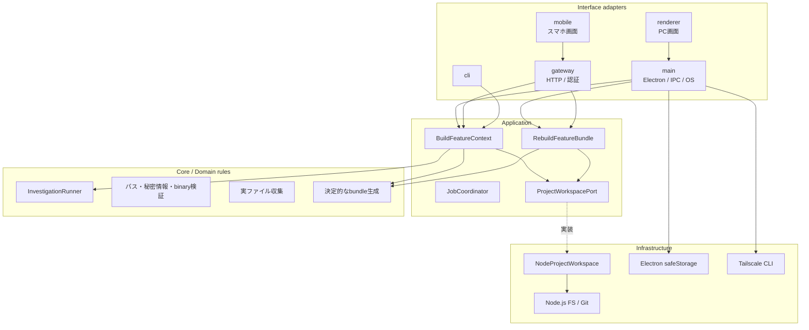

この構成にした理由:

- GUIテストで実際のAI CLIやファイルシステムを起動しなくてよい
- Gemini CLI、Gemini API、Codex CLIの違いをcore全体へ広げない
- PCとスマホで同じ生成ルールを使える
- OSや保存方式が変わっても、ユースケースの変更を最小化できる
- 「bundle再構築ではAIを再実行しない」というルールを独立して守れる

### 3.3 AIプロバイダーをAdapter + Registryにする

AIごとに起動方法、認証、応答形式、作業ディレクトリへのアクセス方法が異なります。一方、AIへ求める最終結果は`Investigation`という共通形式です。

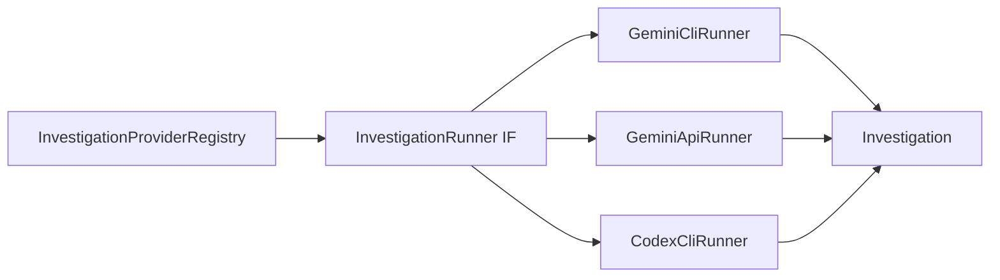

Registryを使うことで、GUIやCLIはプロバイダーIDを選ぶだけで済みます。新しい内蔵プロバイダーを追加しても、パス検証やbundle処理は変更しません。

外部開発者が任意コードを導入するプラグイン機構にはしていません。製品コードへ組み込み、同じセキュリティレビューとテストを通した内蔵プロバイダーだけを登録します。

### 3.4 AIの回答と実ファイルを分離する

AIは「どのファイルが関連するか」と「なぜ関連するか」を返しますが、成果物へ入れるコード本文はAIに再生成させません。

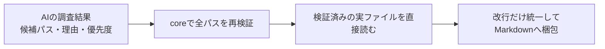

これにより、AIが存在しないパスを返した場合や、コードを取り違えた場合でも、そのまま成果物へ混入しません。

### 3.5 決定的なbundle生成

関連コードツリー、優先順位、成果物名、コードフェンス、文字数計算はcoreが決定的に生成します。AIへ完成済みMarkdownを作らせない理由は次のとおりです。

- 同じ入力から同じ形式を作りやすい
- 最大5件と文字数上限を確実に守れる
- 同じコードの重複収録を防げる
- 元ファイルと成果物の一致をテストできる
- 未収録理由をmanifestへ残せる

### 3.6 ローカルファースト + Tailscale

スマホ連携のためにクラウドサーバーを置かず、PC上の`127.0.0.1`でGatewayを動かし、Tailscale Serveだけを入口にします。

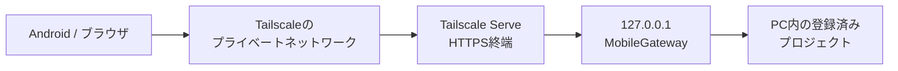

この方式では、ルーターのポート開放、固定グローバルIP、Tailscale Funnel、クラウドへの成果物保存が不要です。代わりに、PCが起動しており、Tailscaleとアプリが動作している必要があります。

### 3.7 資格情報をPCへ閉じ込める

Gemini APIキーはElectron main processが`safeStorage`で暗号化保存します。renderer、スマホ、manifest、bundleには渡しません。

TypeScriptの型だけでは不正なIPC入力を防げないため、`DesktopBuildRequest`からAPIキー項目自体を除き、main processで実行時検証してから保存済みキーを合成します。

### 3.8 Markdown + manifest

成果物は、人が読んでブラウザAIへ添付するMarkdownと、機械が再構築に使う`manifest.json`に分けています。

- Markdown: 利用者とブラウザAIが読む。最大5件
- manifest: 検証結果、自動収録結果、出力情報、警告、スキーマ版を保持する。添付件数には含めない

manifestは読み込み時に実行時検証し、旧Gemini CLI専用形式は境界で現行形式へ移行します。

bundleを一時的な画面表示ではなくファイルとして残すことには、費用面の設計理由もあります。仕様が変わるたびに開発エージェントへリポジトリを再探索させず、同じ検証済みbundleをブラウザAIとの複数回の対話で再利用できます。容量上限を変えたい場合も、manifestからAIなしで全関連候補を再構築できます。これにより、開発エージェントのトークンは仕様確定後の実装とテストへ集中できます。

### 3.9 ローカル機能探索core

外部AIへコードを渡す前に、プロジェクト内で安全なシンボル・コメント索引を作ります。構造化コメント、通常コメント、docstring、class、function、type、import参照を共通の`DiscoveryIndex`へ変換し、根拠付きの順位を計算します。

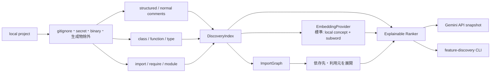

索引と順位付けはローカルだけで行います。完全な構文解析ではなく候補発見用の軽量索引であり、AI送信やbundle収集の直前には既存の安全検証を再実行します。標準Embeddingは追加モデル不要の概念・subword hashingですが、rankerは`EmbeddingProvider` IFへだけ依存するため、将来のローカル学習済みモデルと交換できます。Gemini APIへ渡すパス一覧と本文headerにはlocal scoreと主要根拠を付けます。`feature-discovery` CLIはこのcoreを直接呼ぶだけのinterface adapterで、コード本文の出力、AI送信、成果物の書き込みを行いません。詳しい点数、データ、上限、CLI IFは[ローカル機能探索](local-discovery.md)に記載します。

## 4. モジュール間の関係

### 4.1 ディレクトリ単位の責務

| モジュール | 主な責務 | 主な利用元 | 依存してよい先 |
|---|---|---|---|
| `contracts` | 既定値、プロバイダーカタログ、Desktop DTO、manifest検証 | main、renderer、mobile、core、CLI | 型定義と小さな検証関数 |
| `application` | 調査生成、bundle再構築、ジョブ状態管理、Port定義 | main、gateway、CLI | core、contracts、Port |
| `core` | AI runner、応答解析、検証、収集、tree、bundle | application | Node標準機能、contracts |
| `discovery` | 構造化comment、symbol、import graph、多言語Embedding、説明可能な順位付け | core、discovery CLI | coreの安全検証、Node標準機能 |
| `discovery-cli` | ローカル探索の引数、text / JSON整形、キャンセル | 利用者・CI・自動化 | discoveryの公開façade |
| `infrastructure` | ファイルシステム、Gitを使うPort実装 | applicationのcomposition root | applicationのPort、core |
| `main` | Electron、IPC、OS機能、資格情報、Tailscale | renderer | application、gateway、infrastructure |
| `gateway` | スマホHTTP、認証、登録プロジェクト、SSE、成果物配信 | mobile、main | application、coreの公開型 |
| `renderer` | PC向け表示とユーザー操作 | 利用者 | preloadが公開する`DesktopApi` |
| `mobile` | スマホ向け表示、HTTP/SSEクライアント | 利用者 | gatewayの公開HTTP DTO |
| `cli` | CLI引数を`BuildOptions`へ変換 | 利用者・自動化 | application façade |

### 4.2 調査生成のシーケンス

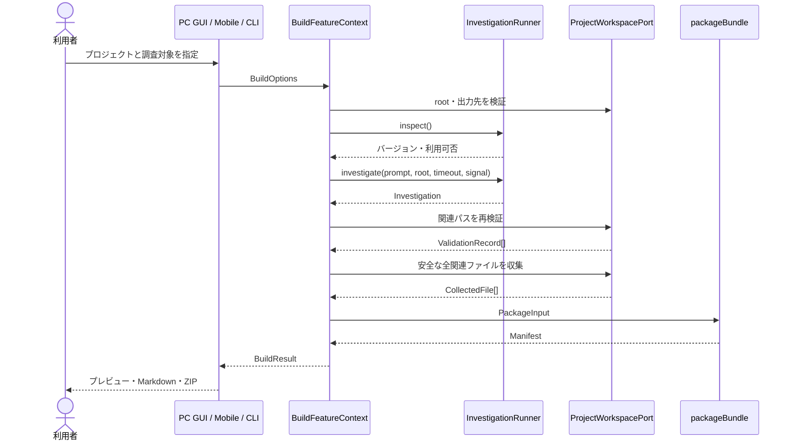

### 4.3 bundle再構築のシーケンス

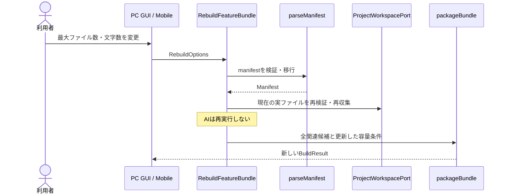

### 4.4 スマホ実行のシーケンス

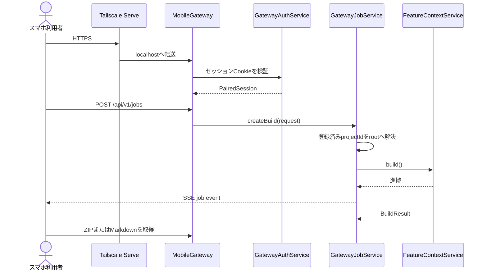

## 5. 主要モジュールのIF

ここでいうIFは、モジュールの外側から使う公開契約です。実装内部の補助関数は含めません。

### 5.1 Application façade

#### `FeatureContextService`

PC、スマホ、CLIが共通で利用する入口です。

```ts
class FeatureContextService {
  build(
    options: BuildOptions,
    report?: ProgressReporter,
    signal?: AbortSignal
  ): Promise<BuildResult>;

  rebuild(
    options: RebuildOptions,
    report?: ProgressReporter,
    signal?: AbortSignal
  ): Promise<BuildResult>;
}
```

| メソッド | 入力 | 出力 | 副作用 |
|---|---|---|---|
| `build` | プロジェクト、機能名、AI、要約・連結、各上限 | `BuildResult` | AI調査、project読み取り、成果物書き込み |
| `rebuild` | manifest、変更後の容量上限 | `BuildResult` | AIは呼ばず、全関連候補の再検証・再収集・成果物再生成 |

`BuildFeatureContext`と`RebuildFeatureBundle`は、façadeの内部で使う独立したユースケースです。どちらも`execute(options, report?, signal?)`を公開し、GUI固有の状態やHTTP responseは扱いません。

### 5.2 AIプロバイダーIF

```ts
interface InvestigationRunner {
  readonly provider: AiProvider;
  inspect(signal?: AbortSignal): Promise<CliInfo>;
  investigate(request: InvestigationRunRequest): Promise<Investigation>;
}

type RunnerResolver = (
  provider: AiProvider,
  config?: RunnerConfig
) => InvestigationRunner;
```

| 型 | 意味 |
|---|---|
| `CliInfo` | プロバイダーID、CLIまたはモデルのバージョン、利用可能option |
| `InvestigationRunRequest` | project root、調査prompt、timeout、cancel signal |
| `Investigation` | 機能名、概要、処理flow、関連file、要約詳細、不明点 |
| `InvestigationFile` | path、role、reason、priority、group、recommended、任意summary |

組み込み実装は`GeminiCliRunner`、`GeminiApiRunner`、`CodexCliRunner`です。`InvestigationProviderRegistry.register()`がfactoryを登録し、`create()`がIDに対応するrunnerを生成します。

### 5.3 Workspace Port

```ts
interface ProjectWorkspacePort {
  resolveProjectRoot(input: string): Promise<string>;
  resolveOutputDir(root: string, outputBase: string | undefined, name: string): string;
  assertOutputInside(root: string, outputDir: string): void;
  assertOutputAvailable(outputDir: string): Promise<void>;
  validateRelatedFiles(root, files): Promise<ValidationOutcome>;
  collectSelectedFiles(root, records): Promise<CollectionOutcome>;
  getGitCommitId(root: string): Promise<string | null>;
  readManifest(manifestPath: string): Promise<Manifest>;
}
```

本番実装は`NodeProjectWorkspace`です。テストではこのPortを差し替えられるため、ユースケース単体でファイルシステムを模擬できます。

### 5.4 bundle IF

外部公開するfacadeは次の3点です。

```ts
collectSelectedFiles(projectRoot, records): Promise<CollectionOutcome>;
packageBundle(input: PackageInput): Promise<Manifest>;
type PackageInput;
```

内部モジュール:

| ファイル | IF | 責務 |
|---|---|---|
| `collector.ts` | `collectSelectedFiles` | 実path、差し替え、秘密情報を再確認してcode収集 |
| `code-packer.ts` | `packCode` | 優先度と意味groupを考慮し、大きなfileは連続行範囲へ分割してcode成果物の容量を使い切る |
| `overview-renderer.ts` | `renderOverview` | tree、理由、flow、警告、未収録をoverviewへ描画 |
| `source-markdown.ts` | `renderCodeBlock` | 元path、実際の行範囲、適切なcode fenceを付与 |
| `output-repository.ts` | 書き込み用内部IF | 一時directoryと復元処理を使った安全な書き込み |
| `package-bundle.ts` | `packageBundle` | 上記を統括し、Manifestを確定 |

#### その他のcoreモジュール

| モジュール | 主な公開IF | 責務 |
|---|---|---|
| `prompt.ts` | `createInvestigationPrompt` | 全AIへ共通の調査指示を作る |
| `investigation.ts` | `parseInvestigation`、`validateInvestigation` | AIのJSONを共通形式へ変換・検証 |
| `validate.ts` | `validateRelatedFiles`、path/binary判定 | AIが返した関連pathを信用せず再検証 |
| `gitignore.ts` | `GitIgnoreResolver` | 階層的な`.gitignore`と否定ruleを評価 |
| `secrets.ts` | `findSensitiveContent` | code内の代表的な認証情報を検出 |
| `project-snapshot.ts` | `buildProjectSnapshot` | Gemini APIへ送る安全なproject情報を作る |
| `tree.ts` | `buildCodeTree` | 検証済み関連pathから決定的なtreeを作る |
| `cli-process.ts` | `runCliProcess`、`CliExecutor` | CLI起動、Windows shim、stdout/stderr、timeout、cancel |
| `errors.ts` | `FeatureContextError`、`asFeatureContextError` | error codeと利用者向けmessageを統一 |

### 5.5 ジョブIF

```ts
class JobCoordinator<Metadata, Result, Progress> {
  start(id, metadata, operation): JobHandle<Metadata, Result, Progress>;
  get(id): CoordinatedJob | undefined;
  list(): CoordinatedJob[];
  hasActive(): boolean;
  cancel(id): boolean;
  subscribe(id, listener): () => void;
  remove(id): boolean;
  stopAll(): void;
}
```

状態は`running`、`completed`、`error`、`cancelled`です。`AbortController`、進捗、完了結果、正規化したerrorをPCとスマホで共通管理します。

### 5.6 主要データ契約

#### `BuildOptions`

| 項目 | 必須 | 意味 |
|---|---|---|
| `projectRoot` | 必須 | 調査対象のproject |
| `feature` | 必須 | 調べたい機能・目的 |
| `provider` | 任意 | `gemini`、`gemini-api`、`codex` |
| `summary` | 必須 | overviewへ詳細要約を入れるか |
| `concat` | 必須 | 実codeをMarkdownへ連結するか |
| `maxOutputFiles` | 必須 | bundle内Markdown上限。1～5 |
| `maxTotalChars` | 必須 | bundle全体の文字数上限 |
| `maxFileChars` | 任意 | 1成果物あたりの上限 |
| `timeoutMs` | 任意 | AI調査のtimeout |
| `dryRun` | 任意 | ファイルを書かずに検証 |
| `force` | 任意 | 既存成果物の置換を許可 |
`geminiApiKey`はapplication内部でだけ利用できる一時値です。Desktop IPC用の`DesktopBuildRequest`からは除外されています。

#### `BuildResult`

```ts
interface BuildResult {
  manifestPath: string;
  outputDir: string;
  manifest: Manifest;
}
```

#### `Manifest`

manifest schema versionは`1.1`です。次を保持します。

- 機能名、project root、生成日時、Git commit ID
- 実行option、AIプロバイダーとversion
- AIの調査結果
- 全関連fileと検証・自動収録結果
- 収録・未収録sourceと理由
- bundle file名と文字数
- 合計文字数、概算token、警告、不明点

`parseManifest(unknown)`が外部入力を検証し、未対応schemaや壊れた値を拒否します。

### 5.7 Desktop IPC IF

rendererへ公開される唯一のOS連携窓口は`window.featureContext: DesktopApi`です。

| 分類 | メソッド | 役割 |
|---|---|---|
| folder | `selectFolder()` | PC調査用folderを1件選択 |
| folder | `selectFolders()` | スマホ登録用folderを複数選択 |
| job | `start(jobId, request)` | 調査生成を開始 |
| job | `rebuild(jobId, request)` | file選択を変えず、容量条件だけでAIなしのbundle再構築 |
| job | `cancel(jobId)` | 子process・HTTP requestを含めcancel |
| job | `onProgress(listener)` | 進捗通知を購読 |
| 成果物 | `readArtifact(path)` | 許可済み成果物をpreview |
| 成果物 | `openOutput(path)` | 許可済み出力folderを開く |
| 成果物 | `copyOverview(path)` | 許可済みoverviewをcopy |
| スマホ | `getRemoteStatus()` | Gateway、Tailscale、登録状態を取得 |
| スマホ | `setRemoteEnabled(enabled)` | Gatewayを起動・停止 |
| スマホ | `registerRemoteProjects(roots)` | 選択済みprojectを複数登録 |
| スマホ | `removeRemoteProject(id)` | 登録projectを解除 |
| スマホ | `createRemotePairing()` | 1回限りのQRを生成 |
| スマホ | `revokeRemoteDevice(id)` | 端末sessionを失効 |
| スマホ | `configureTailscale()` | Tailscale Serveを設定 |
| 設定 | `getGeminiCredentialStatus()` | APIキーの有無と保存元を確認 |
| 設定 | `saveGeminiApiKey(key)` | safeStorageで暗号化保存 |
| 設定 | `clearGeminiApiKey()` | 保存済みキーを削除 |
| 設定 | `setAutoStart(enabled)` | Windowsログイン時起動を設定 |

main processは、完了jobから登録した成果物pathだけを読み取り・open・copy対象として許可します。

### 5.8 Mobile Gateway HTTP IF

`GET /api/v1/health`、`POST /api/v1/pair`、認証状態を調べる`GET /api/v1/session`は未認証でも利用できます。それ以外は有効な`HttpOnly` session Cookieが必要です。

| Method | Path | 入力 | 出力・用途 |
|---|---|---|---|
| GET | `/api/v1/health` | なし | Gateway稼働確認 |
| POST | `/api/v1/pair` | token、deviceName | 端末sessionを作成 |
| GET | `/api/v1/session` | Cookie | 認証状態 |
| POST | `/api/v1/logout` | Cookie | 現在のsessionを失効 |
| GET | `/api/v1/projects` | Cookie | スマホ利用可能project一覧 |
| GET | `/api/v1/jobs` | Cookie | memory内job履歴 |
| POST | `/api/v1/jobs` | `MobileBuildRequest` | 調査jobを開始 |
| GET | `/api/v1/jobs/:id` | Cookie | jobの現在状態 |
| GET | `/api/v1/jobs/:id/events` | Cookie | SSE進捗購読 |
| POST | `/api/v1/jobs/:id/cancel` | Cookie | jobをcancel |
| POST | `/api/v1/jobs/:id/rebuild` | `RebuildRequest` | 容量条件だけでAIなしに再構築 |
| GET | `/api/v1/jobs/:id/artifacts/:name` | Cookie | Markdown preview/download |
| GET | `/api/v1/jobs/:id/bundle.zip` | Cookie | MarkdownだけのZIP |

スマホは`projectId`を指定し、project rootや出力先を直接送りません。`GatewayJobService`がPCに登録済みのIDからrootを解決します。

### 5.9 Gateway内部IF

| モジュール | 主な公開IF | 責務 |
|---|---|---|
| `MobileGateway` | `start`、`stop`、`status`、`createPairing` | HTTP server lifecycleとrouting |
| `GatewayAuthService` | `createPairing`、`pairDevice`、`authenticate` | 1回限りQR、試行制限、session検証 |
| `GatewayJobService` | `list`、`get`、`createBuild`、`createRebuild`、`cancel`、`subscribe` | 登録project限定のjob操作 |
| `GatewaySettingsStore` | `load`、`update`、project/session CRUD | Gateway設定の永続化 |
| `sendArtifact` | completed job、artifact名、response | Markdown配信 |
| `sendBundleZip` | completed job、response | bundle MarkdownのZIP配信 |

### 5.10 OS・外部コマンドIF

| モジュール | IF | 境界 |
|---|---|---|
| `ElectronCredentialStore` | `get/set/clear/hasGeminiApiKey` | Windows暗号化storeと環境変数 |
| `TailscaleService` | `inspect()`、`configureServe(port)` | `tailscale.exe`を引数配列で実行 |
| `CliExecutor` | `CliProcessRequest -> CliProcessResult` | AI CLI子process、timeout、stdout/stderr、cancel |
| `GeminiApiTransport` | `generate(request, signal)` | Gemini API HTTP通信 |

これらはinterfaceまたは注入可能なexecutorを持ち、テストで実commandや外部networkを呼ばずに差し替えられます。

### 5.11 UIコンポーネントIF

PCの`App`とスマホの`MobileApp`はcomposition rootです。

| UIモジュール | 入力 | 外へ通知する操作 |
|---|---|---|
| `ResultPanel` | `BuildResult`、実行状態 | 自動選定sourceの確認、preview、open、copy、再生成、容量再構築 |
| `RemotePanel` | `GatewayStatus`、pairing、busy/error | 起動停止、project登録、QR、端末解除、auto start |
| `CommonSettingsPanel` | credential状態、入力中APIキー | 保存、削除、再確認 |
| `FileCommentHelp` | なし | 構造化file commentの対象、タグ粒度、避ける内容、更新規則を表示 |
| `JobPanel` | `RemoteJob` | 自動選定sourceの確認、cancel、preview、share、容量再構築 |
| `mobileApi` | URL、`RequestInit` | credential付きJSON responseまたは利用者向けerror |

React component内では、Node.jsのファイル読み書き、AI呼び出し、APIキー保存を実装しません。

### 5.12 ローカル探索・Embedding IF

`discovery`の外側からは、個別のparserではなくfaçadeを利用します。

```ts
discoverFeature(
  projectRoot: string,
  feature: string,
  options?: DiscoverFeatureOptions,
  signal?: AbortSignal
): Promise<FeatureDiscoveryResult>;

interface EmbeddingProvider {
  readonly id: string;
  readonly dimensions: number;
  embed(texts: string[], signal?: AbortSignal): Promise<number[][]>;
}
```

`FeatureDiscoveryResult`は安全な`DiscoveryIndex`、project内だけの`ImportGraph`、全加減点を持つ`DiscoveryRanking`を返します。`DiscoveryRankingOptions.embedding`へ`false`を渡すと意味類似度を無効化でき、別providerを渡すと標準実装を差し替えられます。provider異常は警告付きの文字列順位へfallbackし、`AbortError`だけは呼び出し元へ伝えます。

## 6. 進捗・キャンセル・エラー

進捗は次の共通stageで表します。

```text
checking-cli
→ investigating
→ validating
→ collecting
→ packing
→ completed / error
```

キャンセルは`AbortSignal`をapplicationからrunner、CLI子process、Gemini API transportへ渡します。スマホではSSE接続とは別にcancel APIを呼び、PCではIPCを通じて同じ`JobCoordinator`を停止します。

`FeatureContextError`は、未install、未認証、CLI失敗、timeout、cancel、不正JSON、関連fileなし、不正root、権限、出力先、文字数上限などをcode化します。UIは日本語messageを優先し、技術詳細は別表示にします。

## 7. セキュリティ境界

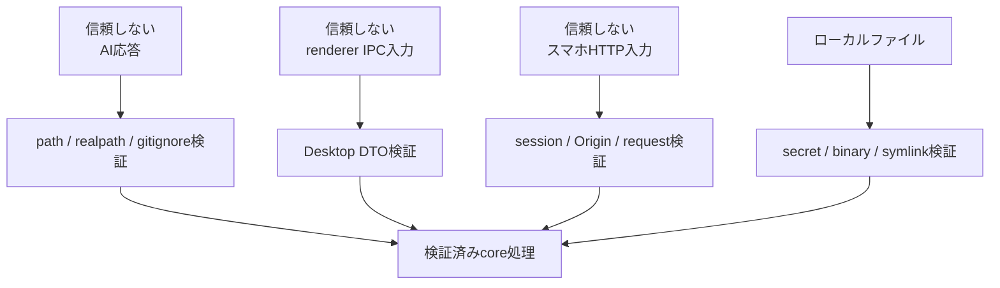

主な防御:

- project外、path traversal、存在しないpath、重複、symlink逸脱を拒否
- `.gitignore`をrootから各subdirectoryまで評価
- `.env`、秘密鍵、生成物、binary、代表的な埋め込みsecretを除外
- AI CLIはshell文字列を作らず、実行fileと引数を分離
- CLIは読み取り専用mode、timeout、cancelを使用
- APIキーをrenderer、スマホ、manifest、bundleへ渡さない
- Gatewayはlocalhostだけでlistenし、Tailscale Funnelを使わない
- QRは32 byte乱数、5分、1回限り
- session Cookieは`HttpOnly`、`Secure`、`SameSite=Strict`
- スマホは登録済みproject IDだけを操作可能
- ZIPへ絶対pathを持つmanifestを入れない

## 8. 内蔵AIプロバイダーの追加手順

1. `InvestigationRunner`を実装する
2. `inspect`で利用可否・version・認証errorを識別する
3. `investigate`でtimeoutと`AbortSignal`を扱う
4. 書き込みを許さない実行modeを選ぶ
5. 応答を`Investigation`へ変換し、構造を検証する
6. `ProviderId`と`PROVIDER_CATALOG`へ追加する
7. `createDefaultProviderRegistry`へfactoryを登録する
8. CLI、PC GUI、スマホGUIの選択肢testを追加する
9. runner単体test、異常終了、認証、timeout、cancelを追加する

パス検証、コード収集、bundle生成をプロバイダー側へ複製してはいけません。

## 9. テスト戦略

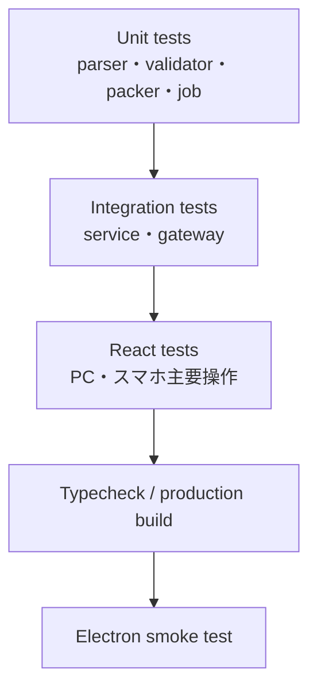

- AI CLIとGemini APIはmockし、通常testで外部通信しない
- coreは生成codeと元fileの一致、安全なpath、上限、上書き防止を重点検証
- gatewayは未認証拒否、QRの1回性、登録project限定、ZIP内容を検証
- GUIはPC・スマホ・共通設定と主要操作を検証
- smoke testはbuild済みElectron、preload、3画面、provider選択、mobile artifactの読み込みを確認

## 10. 実装参照

- [Application façade](../src/application/feature-context-service.ts)
- [生成ユースケース](../src/application/build-context.ts)
- [再構築ユースケース](../src/application/rebuild-bundle.ts)
- [Workspace Port](../src/application/ports.ts)
- [共通ジョブ管理](../src/application/jobs/job-coordinator.ts)
- [主要データ型とInvestigationRunner IF](../src/core/types.ts)
- [AI Provider Registry](../src/core/provider.ts)
- [bundle facade](../src/core/bundle.ts)
- [ローカル探索とEmbedding IF](../src/discovery/types.ts)
- [標準ローカル多言語Embedding](../src/discovery/embedding.ts)
- [Desktop IPC IF](../src/main/preload.cts)
- [スマホGateway HTTP](../src/gateway/server.ts)
- [スマホジョブIF](../src/gateway/job-service.ts)
- [スマホ公開DTO](../src/gateway/types.ts)

## 11. 明示的な非対象

現在の製品範囲は、単一ユーザーが自分のPC上でローカルprojectを安全に調査することです。次は対象外です。

- 外部開発者が任意プラグインをインストールする仕組み
- 複数ユーザー・権限管理
- クラウド分散実行
- 複数PC間のジョブ共有
- 外部プラグインを安全なsandboxで動かす仕組み

これらを実装しないことは拡張性の欠落ではなく、trust boundaryと運用コストを現在の価値に合わせて限定する判断です。
