# Feature Context Builder 開発ストーリー

## 1. この文書について

この文書は、Feature Context Builderが「どの機能を持っているか」ではなく、**なぜその順番で作られたのか**を記録するものです。

材料にしたもの:

- 2026年7月27日から28日に行われた、この開発対話の要点
- Gitに残る全commitの順序、message、変更ファイル
- 実際の画面・CLI・Tailscaleで起きた問題と、その後の判断

対話の文章は読みやすいように要約・意訳しています。厳密な議事録ではなく、利用者の発見がどの設計判断とcommitにつながったかを追うための開発史です。

技術構造そのものは[技術設計書](architecture.md)、製品の背景と価値は[プロダクト企画書](product-overview.md)を参照してください。

### 1.1 最初の文書化で弱かった、もう1つの出発点

初期要件には「ChatGPTへ添付しやすい最大5個のMarkdown」という形が明記されていましたが、その背景にある費用面の狙いは、最初のプロダクト企画書と開発ストーリーで十分に言語化できていませんでした。

本来の狙いは、仕様がまだ揺れている時期に、開発エージェントへ同じコードベースを何度も探索・説明させないことです。一度作った検証済みコンテキストをChatGPTなどのブラウザAIとの対話で再利用し、仕様が固まってから開発エージェントへ渡します。

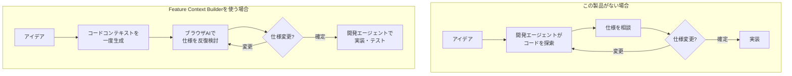

ブラウザAIにもコンテキスト長やメッセージ回数などの制限はあります。ただし、APIや開発エージェントと比べて、利用者の画面では一往復ごとのトークン消費や追加費用が見えにくいことがあります。そこで、**ブラウザAIは仕様の発散と収束、開発エージェントは実装と検証**へ使い分け、後者のトークンと費用を価値の高い工程へ集中させます。

## 2. 先に結論

この製品は、最初から完成形を一度に設計したのではありません。


commitの順番を一言で表すと、次の流れです。

> 動くものを作る → 実際に使う → 詰まった場所を直す → 利用場面を広げる → 広がったriskを固める → 保守できる形へ整理する → 判断理由を残す

この順番だったため、抽象的な拡張性だけを先に作らず、実際に必要になった境界へinterfaceを置けました。

## 3. commitで見る全体タイムライン

```mermaid
flowchart TB
    subgraph P1["第1章 基礎を作る"]
        direction LR
        C01["01 b0cdb95<br/>PC版MVP"] --> C02["02 674e5f9<br/>Codex対応"]
    end

    subgraph P2["第2章 実利用でAI実行を現実に合わせる"]
        direction LR
        C03["03 0dbfaa0<br/>CLI診断"] --> C04["04 a9186f3<br/>GUIへ詳細を保持"]
        C04 --> C05["05 d179938<br/>Gemini API"]
    end

    subgraph P3["第3章 スマホから使える製品へ"]
        direction LR
        C06["06 49c036d<br/>安全なスマホ連携"] --> C07["07 a6be0e0<br/>Android手順書"]
        C07 --> C08["08 e5f0f66<br/>Tailscale安定化"]
        C08 --> C09["09 489206b<br/>API出力形式修正"]
        C09 --> C10["10 14fc7fa<br/>APIキー説明改善"]
        C10 --> C11["11 3510fa5<br/>共通設定へ統合"]
        C11 --> C12["12 442195b<br/>複数project登録"]
    end

    subgraph P4["第4章 製品品質を固める"]
        direction LR
        C13["13 4b5fe56<br/>階層.gitignore"] --> C14["14 9983313<br/>生成pipeline強化"]
    end

    subgraph P5["第5章 保守でき、説明できる形へ"]
        direction LR
        C15["15 af6a4e2<br/>architecture refactor"] --> C16["16 ed003df<br/>技術・product文書"]
        C16 --> C17["17 10f408e<br/>開発story"]
    end

    subgraph P6["第6章 ローカル探索を第2の主機能へ"]
        direction LR
        C18["18 719c5ad<br/>token節約の意図"] --> C19["19 d8b50d1<br/>構造化comment"]
        C19 --> C20["20 7788088<br/>symbol・comment索引"]
        C20 --> C21["21 4f289b7<br/>import graph"]
        C21 --> C22["22 9ad61d6<br/>説明可能な順位"]
        C22 --> C23["23 5427162<br/>discovery CLI"]
        C23 --> C24["24 a0e6584<br/>多言語Embedding"]
    end

    C02 --> C03
    C05 --> C06
    C12 --> C13
    C14 --> C15
    C17 --> C18

    classDef foundation fill:#e7f5f5,stroke:#0c6b70,color:#123;
    classDef feedback fill:#fff4df,stroke:#b56b00,color:#321;
    classDef mobile fill:#eaf0ff,stroke:#4169a1,color:#123;
    classDef quality fill:#f4eaff,stroke:#74479b,color:#213;
    classDef structure fill:#eaf7e8,stroke:#4c7d47,color:#123;
    classDef discovery fill:#e8f4ff,stroke:#2878a8,color:#123;
    class C01,C02 foundation;
    class C03,C04,C05 feedback;
    class C06,C07,C08,C09,C10,C11,C12 mobile;
    class C13,C14 quality;
    class C15,C16 structure;
    class C18,C19,C20,C21,C22,C23,C24 discovery;
```

## 4. 対話からcommitへ変わる流れ

対話は、単なる追加要望の列ではありませんでした。1つの回答や実装を実際に試した結果が、次の設計要件を生みました。

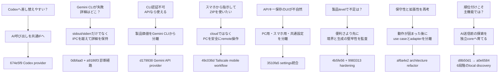

## 5. commit一覧

| # | 日時（JST） | Commit | その時点で解いた問い |
|---:|---|---|---|
| 1 | 7/27 17:44 | [`b0cdb95`](https://github.com/matsutanishimpei/make-summary/commit/b0cdb953721d32d32a493378ca3a6b25d1ef0dd8) | 最初の要件をPC GUI・CLI・coreとして一巡できるか |
| 2 | 7/27 18:29 | [`674e5f9`](https://github.com/matsutanishimpei/make-summary/commit/674e5f9251b452cc42c7c806d6f38cd074897b9a) | GeminiだけでなくCodexへきれいに差し替えられるか |
| 3 | 7/28 11:47 | [`0dbfaa0`](https://github.com/matsutanishimpei/make-summary/commit/0dbfaa0fdb05599464b2562c9c18f37e9c7ab00c) | Gemini CLI失敗の原因を捕まえられるか |
| 4 | 7/28 11:59 | [`a9186f3`](https://github.com/matsutanishimpei/make-summary/commit/a9186f3904b00c98ae7c81d2d4f063b8bf739e71) | 捕まえた技術詳細をGUIまで失わず届けられるか |
| 5 | 7/28 13:00 | [`d179938`](https://github.com/matsutanishimpei/make-summary/commit/d179938ce7bdd0796aa026b0f3ad8135524d023b) | CLI認証が使えない環境でも調査を続けられるか |
| 6 | 7/28 14:14 | [`49c036d`](https://github.com/matsutanishimpei/make-summary/commit/49c036de75edbd0bf97bd68c4c0efcf4ae612b96) | スマホから安全にPCへ調査を依頼しZIPを使えるか |
| 7 | 7/28 14:18 | [`a6be0e0`](https://github.com/matsutanishimpei/make-summary/commit/a6be0e0e13b75e55888653a2640d492de1e0ed02) | AndroidとTailscaleを知らない人でも初回設定できるか |
| 8 | 7/28 15:26 | [`e5f0f66`](https://github.com/matsutanishimpei/make-summary/commit/e5f0f669b358a83765711ec2d26872072550b2a0) | Tailscale Serve失敗やport競合を実環境で解決できるか |
| 9 | 7/28 15:39 | [`489206b`](https://github.com/matsutanishimpei/make-summary/commit/489206b19b3aafcc079a097d6233c0f3d9fc4356) | Gemini APIの構造化出力を実際の仕様で通せるか |
| 10 | 7/28 15:53 | [`14fc7fa`](https://github.com/matsutanishimpei/make-summary/commit/14fc7fa075454f39639e7a15c2ce3b776e14e1aa) | スマホ実行時のAPIキー保存場所を誤解なく示せるか |
| 11 | 7/28 16:18 | [`3510fa5`](https://github.com/matsutanishimpei/make-summary/commit/3510fa54a8f39ccc252d4062f661d79138e3b875) | PCとスマホで同じAPIキーを自然な画面構成で管理できるか |
| 12 | 7/28 17:47 | [`442195b`](https://github.com/matsutanishimpei/make-summary/commit/442195b4348c32d7810e2ab801a6f0c161eace0a) | スマホ利用プロジェクトを複数まとめて登録できるか |
| 13 | 7/28 18:01 | [`4b5fe56`](https://github.com/matsutanishimpei/make-summary/commit/4b5fe563ab7a1fe4a9f827043677f02bf23537b1) | サブディレクトリごとの`.gitignore`も正しく守れるか |
| 14 | 7/28 18:36 | [`9983313`](https://github.com/matsutanishimpei/make-summary/commit/998331370d720aeaea5f8e1c557a1e17c2c57d41) | 製品化に必要な高優先度の安全性と失敗耐性を満たせるか |
| 15 | 7/28 19:33 | [`af6a4e2`](https://github.com/matsutanishimpei/make-summary/commit/af6a4e205c425ff46653b1c21d29d29c03abb0fe) | 機能を保ったまま保守・拡張しやすい構造へ移せるか |
| 16 | 7/28 19:54 | [`ed003df`](https://github.com/matsutanishimpei/make-summary/commit/ed003dff1ecbb6cba792898ce7183cd280dbe5a9) | 技術判断とプロダクト価値を次の人へ説明できるか |
| 17 | 7/28 20:06 | [`10f408e`](https://github.com/matsutanishimpei/make-summary/commit/10f408ebf74fada209d81e035c3904a49d0fba38) | 対話上の転機とcommit順の理由を一続きで追えるか |
| 18 | 7/28 20:18 | [`719c5ad`](https://github.com/matsutanishimpei/make-summary/commit/719c5adf557a586016a339a537395c2b0c07911b) | ブラウザAIで仕様を固め、開発エージェントのtokenを実装へ集中する意図を明文化できるか |
| 19 | 7/28 20:52 | [`d8b50d1`](https://github.com/matsutanishimpei/make-summary/commit/d8b50d1787d8f2bfd07497f919d92fa2dc95936d) | 機能と責務をfile自身へ検索可能な形で残せるか |
| 20 | 7/28 20:53 | [`0a280a3`](https://github.com/matsutanishimpei/make-summary/commit/0a280a3e0b1de86d6e1f203721f6c7593642636c) | 構造化file commentを検証後にmainへ統合できるか |
| 21 | 7/28 20:58 | [`7788088`](https://github.com/matsutanishimpei/make-summary/commit/7788088e2f6a2d74c27ec1cce5d4fdd63dc8b686) | commentとsymbolを秘密情報なしの共通索引へできるか |
| 22 | 7/28 20:58 | [`8f5bfc0`](https://github.com/matsutanishimpei/make-summary/commit/8f5bfc07e88113f4d133acd14c0dc2ed7cab60a9) | 安全なsymbol・comment索引を検証後にmainへ統合できるか |
| 23 | 7/28 21:03 | [`4f289b7`](https://github.com/matsutanishimpei/make-summary/commit/4f289b7c19c6ed4e29394ae7a56516af5c3f718a) | 名前一致だけでなくimport先と利用元をたどれるか |
| 24 | 7/28 21:03 | [`c948322`](https://github.com/matsutanishimpei/make-summary/commit/c948322dce08e7a5324203ae5dc7401e1e574dea) | project内import graphを検証後にmainへ統合できるか |
| 25 | 7/28 21:11 | [`9ad61d6`](https://github.com/matsutanishimpei/make-summary/commit/9ad61d6b26d1beb2229dce9ea9d34f53a5d32649) | なぜそのfileを選んだかを全加減点として説明できるか |
| 26 | 7/28 21:11 | [`f4d2ec1`](https://github.com/matsutanishimpei/make-summary/commit/f4d2ec1369dd7ee32030105af198d3f51679709c) | 説明可能な順位をGemini APIの本文選定へ統合できるか |
| 27 | 7/28 21:20 | [`5427162`](https://github.com/matsutanishimpei/make-summary/commit/5427162ed10d27f4141215cc3c9dde33e44fb799) | 同じ探索coreをAIなしの薄いCLIとして切り出せるか |
| 28 | 7/28 21:20 | [`0a0c91d`](https://github.com/matsutanishimpei/make-summary/commit/0a0c91d024c2414febb8192a3a36bc22a5edf9a8) | discovery CLIを検証後にmainへ統合できるか |
| 29 | 7/28 21:27 | [`a0e6584`](https://github.com/matsutanishimpei/make-summary/commit/a0e6584d162d3bae5a36006f7badb91e9e059bf3) | 日本語と英語の意味類似度をlocal・差し替え可能な根拠にできるか |
| 30 | 7/28 21:27 | [`518134e`](https://github.com/matsutanishimpei/make-summary/commit/518134ea367273f3992544f4048bac653875303e) | 多言語Embeddingを全回帰後にmainへ統合できるか |

## 6. 第1章 — まず縦に一巡させる

### 6.1 `b0cdb95` — 最初のFeature Context Builder

最初の依頼は非常に具体的でした。プロジェクトフォルダと「ログイン機能」のような調査対象を入力し、Gemini CLIへ調査させ、関連ツリー、ファイルと理由、任意要約、任意コード連結を最大5件のMarkdownへまとめる。さらにGUIとCLIは同じcoreを使い、安全なパス検証、キャンセル、上書き防止、テストまで必要でした。

この「最大5件でChatGPTへ渡す」という要件は、単なる添付制限への対応ではありませんでした。仕様検討のたびに開発エージェントへコード探索からやり直させず、持ち運べるコンテキストをブラウザAIとの対話で使い回すという、トークンと費用の分担も意味していました。この意図は実装の形には入っていた一方、当時の文書では明文化が不足していました。

ここで最初に作ったのは、画面だけのprototypeではなく、次を端から端まで通す縦切りのMVPです。

- Electron + React + TypeScriptのPC GUI
- 同じcoreを呼ぶCLI
- Gemini CLIの非対話実行
- AI応答のJSON解析
- パス、秘密情報、バイナリ、`.gitignore`の基本検証
- 実fileからのcode収集
- overviewと最大5件のbundle
- manifest、preview、再選択、再構築
- 単体テスト、GUIテスト、Electron起動テスト

このcommitが大きいのは、先に土台だけを作るのではなく、**本当に成果物ができるところまで一巡させないと、次に置くべきinterfaceが分からない**と判断したためです。

次の転機は、実装後すぐに出た問いでした。

> 「これってCodexのCLIへの差し替えも容易にできるもの？」

### 6.2 `674e5f9` — Codex対応で「差し替え可能」を実証

初期実装にはGemini CLIの呼び出しがありましたが、「将来差し替えられるつもり」と「実際に別CLIを追加できる」は違います。そこでCodex CLIを実装し、GUIからGemini/Codexを選べるようにしました。

このとき導入・整理したもの:

- 共通の`InvestigationRunner`
- provider解決
- GeminiとCodexで共有する調査結果parser
- shellを使わない共通CLI process実行
- Windowsのnpm `.cmd` shim解決
- Codex JSONL解析
- providerごとのtest

このcommitが2番目に入ったことで、provider分離は将来用の抽象化ではなく、実際に使われるIFになりました。

ただし、AIを選べるだけでは実利用に十分ではありませんでした。翌日、Gemini CLIをinstallしてGUIから動かすと、画面には「実行に失敗しました」としか出ませんでした。

## 7. 第2章 — 実環境の失敗からAI実行を作り直す

### 7.1 `0dbfaa0` — 「失敗した」から「原因を調べられる」へ

対話では、Gemini CLIのinstall自体は成功しました。

> `npm install -g @google/gemini-cli` は成功した
> しかしGUIでは「Gemini CLIの実行に失敗しました」

最初の問題はGeminiそのものではなく、診断情報が足りないことでした。そこでCLI process層で次を改善しました。

- stdout、stderr、exit codeの扱い
- command起動失敗とCLI異常終了の区別
- Gemini固有の失敗messageへ技術詳細を付与
- 再発防止テスト

この修正でcore側は詳細を持てるようになりました。しかし実際のGUIでは、まだ`message=...`程度しか見えませんでした。

### 7.2 `a9186f3` — 詳細をIPCの途中で落とさない

対話の次の反応は明確でした。

> 「詳細なんてどこにでてんの」
> 詳細を開いても同じmessageしかない

原因は、coreで作った詳細がElectron main processからGUIへエラーを渡す途中で失われていたことです。そこで、未知エラーも含めて`name`、`message`、`code`、stack、provider詳細をIPC responseへ残すようにしました。

2つの診断commitが連続した理由:

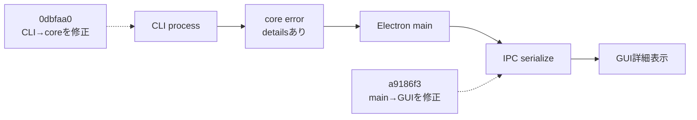

最初の修正を実際にGUIで試したからこそ、問題がCLI層だけでなく境界をまたぐerror伝搬にもあると分かりました。

### 7.3 `d179938` — Gemini CLIの問題を、製品停止にしない

詳細が見えるようになった結果、Gemini CLIの対話画面には次の本当の原因が出ました。

- Google sign-inに失敗
- 現在のaccountはGemini Code Assist for individualsの対象外

これはアプリのbugではなく、利用accountとservice条件の問題です。CLI側を何度直しても解決できません。

対話では次の発想へ進みました。

> 「Gemini APIは無料でもいけるのにCLIはいけないのか」
> 「APIのIF追加は難しいかな？」
> 「戻りが指定通りでなくてerror祭りにならない？」

このcommitではGemini APIを3つ目のproviderとして追加し、API特有の課題も同時に扱いました。

- APIキーとmodel指定
- ローカルフォルダを直接読めないAPI向けの安全なproject snapshot
- JSON Schemaによる構造化出力
- 不正JSONだけを1回補正するretry
- APIの認証、利用上限、timeout、cancelのエラー分類
- APIへ送る前と、戻りpathに対する二重検証
- Gemini CLI / Gemini API / Codex CLIのGUI・CLI選択

この順番が重要です。Gemini APIを最初から入れたのではなく、**CLI認証が製品利用を止めることが実証された後に、provider選択を可用性の要件へ昇格**させました。

## 8. 第3章 — PCツールから、外出先のアイデアを扱う製品へ

### 8.1 `49c036d` — 安全なスマホremote workflow

Gemini APIまで動く見通しが立つと、次の利用場面が提案されました。

> 「スマホから指示して、圧縮fileをスマホでも使えるようにしたい」
> 「PCを普通のnetworkにつないでおくだけで通信できるの？」

ここで選んだのはcloud serviceではなく、Tailscaleを使って自分のPCをprivateに操作する方式です。

実装した主な要素:

- localhostだけで待つ`MobileGateway`
- Tailscale Serveによるprivate HTTPS
- React PWAのスマホ画面
- 32 byte乱数、5分、1回限りのQR pairing
- hash保存した端末sessionとsecure Cookie
- PCで登録したproject IDだけをスマホへ公開
- job進捗のSSE、cancel、再構築
- Markdown preview、個別保存、Web Share、ZIP
- APIキーをスマホへ送らずPCへ暗号化保存
- task trayとWindows login時起動

スマホ連携がこの時点まで後だった理由は、remote入口を作る前に、同じcoreが複数providerで安定して動く必要があったためです。未成熟な処理をremote公開すると、error調査もsecurity設計も複雑になります。

### 8.2 `a6be0e0` — 機能だけでなく、初回成功までを製品に含める

スマホ連携の実装直後、利用者から次の要望が出ました。

> 「AndroidのTailscaleの使い方もよく知らないから、manualも日本語で」

そこで、install、same accountでの接続、PC側設定、QR pairing、home画面追加、ZIPをChatGPTへ添付する方法、troubleshootingまでを日本語manualとして追加しました。

このcommitが機能commitの直後にあるのは、Tailscaleを知っている開発者だけが使える状態では「GUIだけで完結する」というproduct体験を満たさないからです。

### 8.3 `e5f0f66` — screenshotで見えたTailscaleの現実

実機で「Tailscale Serveを自動設定」を押すと、command失敗が表示されました。その後、再起動時には`EADDRINUSE`も発生しました。

対話で確認された論点:

- `npm run dev`を管理者で起動すべきなのか
- Tailscale CLIのversionに合うserve構文か
- 既存のapp processがtask trayに残っていないか
- port競合を利用者へどう説明するか
- permission errorと一般errorを区別できるか

このcommitでは、Tailscale executableの確実な探索、接続状態のJSON確認、非対話のserve設定、permission・timeout errorの日本語化、二重起動防止、port競合の案内を強化しました。

設計上の学びは、remote機能では「正しいcommand」だけでなく、**version、権限、process lifecycle、再実行時の状態**までが1つの機能だということです。

### 8.4 `489206b` — Gemini APIの仕様差を小さく直す

スマホからGemini APIを実行すると、構造化出力のrequest形式が実際のAPI仕様と合わず失敗しました。

このcommitでは、Gemini APIへ送るJSON Schemaの表現を利用可能な形式へ修正し、同じ問題が戻らないtestを追加しました。

大規模な作り直しをしなかった理由は、provider IF、snapshot、response parserという境界がすでにあったためです。外部APIの仕様差をadapter内の小さな修正で閉じ込められました。

### 8.5 `14fc7fa` — 「保存場所が分からない」を画面の問題として扱う

次に起きたのは機能errorではなく、UIの意味のerrorでした。

> スマホからGemini APIを呼ぶと「キーが入力されていない」
> PCでWindows暗号化保存される契機はいつか
> PCには保存buttonがあるのか

最初の対応では、スマホ連携画面に「キーはスマホへ送らずPCへ保存する」ことと、保存状態・操作を明示しました。

このcommitは応急的な説明改善でした。しかし対話を進めると、より根本的な違和感が出ました。

> 「PC版では保存させないのはなぜ？」
> 「PC版・スマホ版・共通設定画面に分けた方が自然では？」

### 8.6 `3510fa5` — PC・スマホ・共通設定へ再編

前commitで文章を足しただけでは、APIキーがスマホ専用設定に見える構造自体は変わりません。実際には1つの保存済みキーをPC実行とスマホ実行が共有します。

そこで画面を次の3つへ分けました。

- PC版: 調査と成果物生成
- スマホ版: 接続、プロジェクト、端末管理
- 共通設定: Gemini APIキーの暗号化保存

同時に、PCからGemini APIを選んだ場合もmain processが同じ暗号化storeからkeyを解決するよう統一しました。

この2段階のcommitは、対話型開発の特徴をよく表しています。

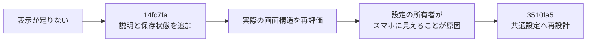

最初から大改修せず、説明不足か情報設計の問題かを実利用で切り分けた順番です。

### 8.7 `442195b` — スマホ利用projectを複数まとめて登録

スマホ連携が日常利用に近づくと、1件ずつ現在のfolderを登録する操作が負担になりました。

> 「スマホ用のproject追加で、一度に複数folderを選べるようにしたい」

このcommitではElectronの複数directory選択、重複除去、まとめて登録するsettings API、GUIとtestを追加しました。

スマホ側から任意pathを指定できないsecurity原則は維持し、PCで明示的に選んだ複数projectだけを追加できるようにしています。便利さのためにtrust boundaryを広げなかった点が重要です。

## 9. 第4章 — 「かなり完成度が高い」から製品品質を監査する

### 9.1 `4b5fe56` — 階層`.gitignore`を完全に評価

機能がそろった段階で、対話は追加機能からproduct qualityの監査へ移りました。

> 「このツール、アイデア支援ツールとして完成度が高いのでは？」
> 「製品levelとはまだ言い切れない箇所がある？」
> 「subdirectoryごとの`.gitignore`完全対応はなぜやっていない？」

初期実装はrootの`.gitignore`を中心に評価していました。しかし実repositoryでは、subdirectoryごとのruleや否定patternが存在します。AI APIへ送るsnapshotと、最終code収集の両方で正しく除外する必要があります。

このcommitでは`GitIgnoreResolver`を導入し、rootからfileの親directoryまでのrule、否定rule、directory除外、Windows pathをGitに近い順序で評価しました。

この修正がhardeningの最初だった理由は、`.gitignore`違反が単なる精度低下ではなく、送るべきでないfileをAIへ渡すsecurity問題になり得るからです。

### 9.2 `9983313` — 高優先度の安全性と失敗耐性をまとめて強化

続く問いは、見えている1件だけでなく、保留していた高優先度課題をすべて洗い出すものでした。

> 「機能的に入れないとまずいけど放っていたものは？」
> 「優先度高はすべて入れて」

ここでは追加画面より、生成pipelineの境界を重点的に強化しました。

- 代表的なAPI key、access token、JWT、コード内credentialの検出
- 検出値そのものをlogへ出さず、file本文全体を除外
- file収集直前のrealpath、通常file、差し替え、`.gitignore`、secret再検査
- Gemini API調査全体のtimeout
- snapshot走査ファイル数、総byte、1ファイルsizeの上限
- 構造化要約の責務、data flow、API、外部依存、変更注意点
- 同一groupが1成果物へ収まらない場合の複数artifact化
- 一時directoryへ書き終えてから入れ替える原子的な成果物更新
- 再生成失敗時の旧成果物復元と、管理外fileの保持
- 各境界の再発防止テスト

このcommitは「できること」を増やすより、「失敗しても危険な状態や中途半端な成果物を残さないこと」を増やしています。

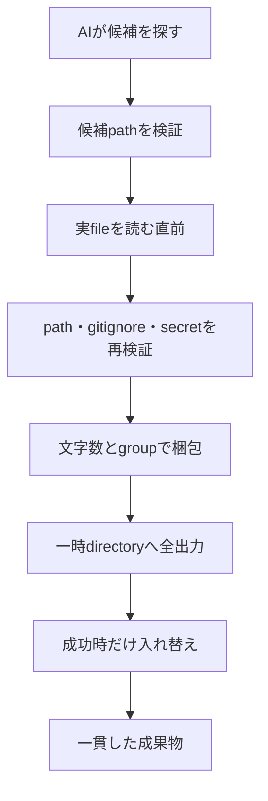

## 10. 第5章 — 動作が固まってからarchitectureを整理する

### 10.1 `af6a4e2` — 保守性と拡張性のrefactor

機能と安全性がそろった後、対話はarchitectureへ移りました。

> 「保守性と拡張性を意識したarchitectureの再考を」
> 「外部plugin、複数user、cloud分散、複数PC共有、sandboxは要らない。それ以外はrefactorして」

ここで初めて大きな構造整理を行いました。

- `contracts`: 既定値、provider catalog、Desktop DTO、manifest runtime validation
- `application`: build/rebuild use case、Port、共通job coordinator
- `infrastructure`: Node filesystem/Git workspace実装
- `core/bundle`: collector、packer、overview、repository、facade
- `gateway`: HTTP、auth、job、artifact配信へ分割
- `renderer` / `mobile`: feature componentとAPI clientへ分割
- `InvestigationProviderRegistry`
- PCとスマホで共有する`JobCoordinator`
- IPC入力のruntime validationとAPI key除外
- manifest schema validationと旧形式migration

refactorを最初にしなかった理由:

1. Gemini、Codex、APIの実際の差が見える前では、provider IFを推測で作ることになる
2. スマホを作る前では、PCとmobileに共通なjob管理が本当に必要か分からない
3. APIキーUIの所有関係が固まる前では、contractsの境界が変わり続ける
4. hardening前では、bundleをどの責務へ分けるべきか判断材料が足りない

つまり、先にproduct behaviorを学び、その後で変化しやすい境界を抽出しました。

### 10.2 `ed003df` — 暗黙の判断を説明可能にする

refactor後、次の依頼はcodeではなく説明でした。

> 技術documentにarchitectureの選定理由、module関係、IFをまとめる
> プロダクトオーナー目線で背景、課題、機能をまとめる

このcommitで[技術設計書](architecture.md)と[プロダクト企画書](product-overview.md)を作りました。

文書化が最後だった理由は、単に後回しにしたからではありません。認証問題、スマホ実機、UIの違和感、security監査、refactorを経て、初めて「なぜこの構成なのか」を実体験に基づいて説明できる状態になったためです。

### 10.3 `10f408e` — 対話とcommitの間にある因果を残す

技術設計書とプロダクト企画書の次に求められたのは、「ここまでのcommitがなぜこの順で入ったのか」を対話と図で追える文書でした。そこで、この開発ストーリーの初版を追加しました。

初版は16件のcommitと、実機利用から生まれた修正の流れを記録しました。一方で、最大5件のMarkdownをブラウザAIへ渡す理由を「添付しやすさ」として説明するに留まり、開発エージェントのトークンと費用を抑えながら仕様確定まで進める、というプロダクトの経済的な出発点を十分に表現できていませんでした。

その不足が今回の対話で指摘されたことで、この文書自身も訂正されました。これは過去を後から美化するためではなく、**実装に現れていた形と、プロダクトオーナーが意図していた価値を区別し、言語化が遅れた事実も履歴へ残す**ためです。

## 11. architectureが育った順序

commit順にarchitectureだけを抜き出すと、次のように発展しています。

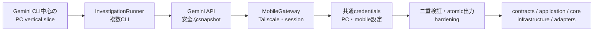

この進化では、後の層が前の層を否定していません。

- 最初のMVPで、必要なend-to-end behaviorを確定
- Codexで、AI差し替え点を確定
- Gemini APIで、local accessの有無というprovider能力差を確定
- スマホで、IPC以外にHTTP/SSEという入口を追加
- 共通設定で、credentialの所有者をmain processへ確定
- hardeningで、各trust boundaryの責務を確定
- refactorで、それらをmoduleとして明文化

## 12. なぜこの順番がよかったのか

### 12.1 仕様検討と実装の間に、再利用できるcontextを置いた

最初からコードを編集するエージェントを作らず、検証済みbundleを成果物にしました。これにより、仕様が固まるまではブラウザAIと何度でも相談し、決定後に開発エージェントへ渡せます。探索と実装を同じAIセッションで繰り返すより、エージェントのトークンを実装・テストへ集中できる順番でした。

### 12.2 抽象化より先に、2つ目の実例を作った

`InvestigationRunner`はGeminiだけの時点で完成させず、Codexを追加しながら整えました。これにより、共通部分とprovider固有部分を実例から分けられました。

### 12.3 error表示を、利用者の再実行可能性として扱った

診断を2commitに分けたことで、errorは発生箇所だけ直せばよいのではなく、CLIからGUIまで情報が届いて初めて役に立つと確認できました。

### 12.4 mobileをcloud化と同義にしなかった

スマホ利用の要望に対し、クラウドサーバーやrepository uploadを増やさず、Tailscaleとlocalhost Gatewayを選びました。既存のローカルファーストとソース非編集の原則を維持できました。

### 12.5 UIの違和感をdata ownershipの問題まで掘った

APIキーの説明追加で終わらず、PC・スマホ・共通設定へ再編しました。「どこにbuttonを置くか」ではなく「誰がcredentialを所有するか」をmain processへ統一したため、後のIPC contractも自然になりました。

### 12.6 hardeningをrefactorより先に行った

先に安全性を監査したことで、refactor時には次の本当の責務が見えていました。

- pathを検証する責務
- 実fileを再検証して読む責務
- artifactへ配置する責務
- 原子的に書く責務
- manifestを検証する責務
- credentialsを境界の外へ出さない責務

その結果、単にfileを小さくするのではなく、失敗条件とsecurity boundaryに沿ってmoduleを分けられました。

## 13. 対話型開発で繰り返したloop

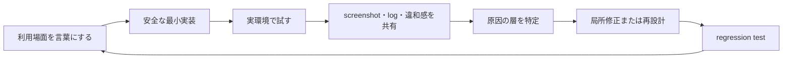

このloopの具体例:

| 試したこと | 観測したこと | 最初の修正 | 深い修正 |
|---|---|---|---|
| Gemini CLIをGUIから実行 | 一般errorしか見えない | CLI詳細を保持 | IPC serializeも修正 |
| Gemini CLIへGoogle login | accountが利用対象外 | 原因を正しく表示 | Gemini API providerを追加 |
| Tailscale自動連携 | command failure、port競合 | commandとerror改善 | single instance・lifecycle改善 |
| スマホでGemini API | keyの保存場所が不明 | 説明と状態を追加 | PC・スマホ・共通設定へ再設計 |
| 製品品質を監査 | nested `.gitignore`未対応 | resolverを追加 | pipeline全体を二重検証・atomic化 |

## 14. この履歴から得られる設計原則

1. **トークンと費用もarchitectureの入力条件にする**
   仕様検討と実装で同じAIを使い続けるのではなく、再利用できるcontextを境界にして、ブラウザAIと開発エージェントへ役割を分けます。

2. **利用者が実際に詰まった場所は、architecture boundaryの候補になる**
   CLI→main→GUIのerror伝搬や、スマホ→Gateway→coreのjob伝搬がその例です。

3. **外部serviceの制約をproduct全体の停止理由にしない**
   Gemini CLI認証不可をGemini API/Codexの選択で吸収しました。

4. **便利なremote操作ほど、許可範囲を狭くする**
   スマホは登録済みproject IDだけを扱い、任意pathやAPI keyを持ちません。

5. **AIには探索を任せ、正しさはdeterministicなcoreで担保する**
   パス、コード本文、ツリー、上限、成果物はAIの自由出力にしません。

6. **説明を足しても違和感が消えないときは、情報設計を見直す**
   APIキーUIは説明追加から共通設定への再設計へ進みました。

7. **refactorは完成後ではなく、変化のpatternが見えた時に行う**
   provider、job、bundle、gatewayに複数の実例ができた時点で分離しました。

8. **文書は仕様だけでなく、判断理由を保存する**
   現在のcodeだけでは「なぜcloudでなくTailscaleか」「なぜ外部pluginを対象外にしたか」は復元しにくいためです。

## 15. 次の開発者が履歴をたどる方法

### 15.1 Gitで全体を見る

```powershell
git log --reverse --oneline
```

### 15.2 特定commitの意図と差分を見る

```powershell
git show 3510fa5
git show --stat 9983313
```

### 15.3 あるfileがどの対話段階で変わったかを見る

```powershell
git log --follow -- src/renderer/App.tsx
git log --follow -- src/gateway/server.ts
```

### 15.4 文書の変化を見る

- [この開発ストーリーの履歴](https://github.com/matsutanishimpei/make-summary/commits/main/docs/development-story.md)
- [技術設計書の履歴](https://github.com/matsutanishimpei/make-summary/commits/main/docs/architecture.md)
- [プロダクト企画書の履歴](https://github.com/matsutanishimpei/make-summary/commits/main/docs/product-overview.md)

## 16. この文書自身の位置づけ

この開発ストーリーの初版は、上記16commitの後に[`10f408e`](https://github.com/matsutanishimpei/make-summary/commit/10f408ebf74fada209d81e035c3904a49d0fba38)として追加されました。新しい製品動作ではなく、対話とGitに分散していた「なぜ」を時系列へ固定するためのcommitです。

初版の直後、「開発エージェントのトークンを抑えながら、ブラウザAIで仕様確定まで進めたいという課題感が見えない」という指摘がありました。そこで、費用面の出発点、ブラウザAIと開発エージェントの役割分担、bundleを再利用する意味を追記しました。文書に不足が見つかった対話も、製品理解が深まった1つの開発イベントとして扱います。

今後、大きな方向転換や利用上の転機があった場合は、単にcommit表へ1行足すだけでなく、次の3点を追記します。

1. 利用者が何をしようとしていたか
2. 実際に何が起きたか
3. その結果、どの設計原則やmodule境界が変わったか

これにより、履歴は完成したcodeの説明ではなく、次の判断に使えるproduct memoryになります。なお、この文書を更新するcommit自身のhashは確定前には書けないため、文書改訂commitは次回の更新時に一覧へ追加します。

## 17. 第6章 — 「AIへ送る前の順位付け」を第2の主機能へ育てる

### 17.1 転機は、送信量の説明から始まった

Gemini APIへ何を送るかを確認する対話で、プロジェクト全体を無条件に送るのではなく、機能名との一致度で順位を付け、上限へ収まる本文だけを送る仕組みが見えました。そこで利用者から「むしろそれがメイン機能まである」という評価が生まれました。

この発見で、ローカル順位付けはGemini API adapter内部の小さな前処理ではなくなりました。

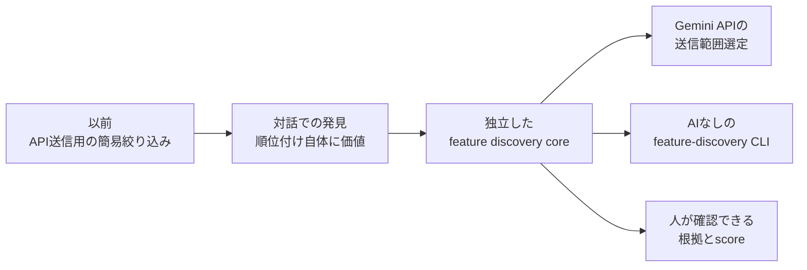

AIを呼ぶ前に候補を狭められれば、送信token、noise、待ち時間を同時に減らせます。また、AI CLIが使えない環境でも「関係しそうなfileと理由」まではPCだけで確認できます。これは最初の目的だった、ブラウザAIへ渡すcontextを小さく安全に作ることへ直接つながります。

### 17.2 なぜ6段階をこの順番にしたか

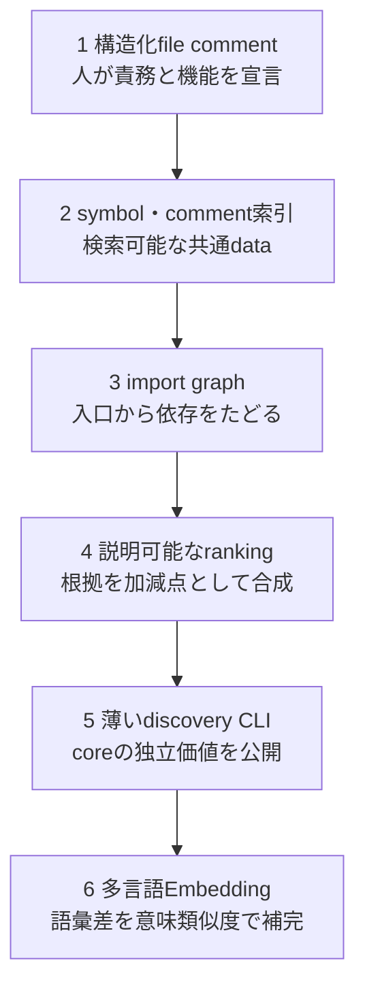

順序には次の理由があります。

1. **構造化commentを先に置く**
   機械推測だけに頼らず、人が知っている機能・責務・入口・flowを最も強い意味手掛かりとして用意しました。`AGENTS.md`に運用規則も置き、実装と説明のずれをレビュー可能にしました。

2. **次にsymbol・commentを共通索引へする**
   構造化commentがまだない既存fileも候補にする必要があります。安全走査、階層`.gitignore`、秘密情報、binary、生成物除外を共通入口にし、後続機能が各自でfile systemを読み直さない形にしました。

3. **nodeが揃ってからimport graphを作る**
   path解決より先に安全なfile集合を確定することで、graphがproject外や除外fileへ広がるのを防げます。直接一致した入口だけでなく、その依存先と利用元を区別してたどれるようになりました。

4. **根拠が複数揃ってからrankingする**
   pathだけで順位を決めず、comment、symbol、import、source配置、file size、test属性、graph距離を個別の`evidence`にしました。合計scoreは常にevidenceの和で、人とtestが選定理由を再計算できます。

5. **coreが安定してからCLIを薄く載せる**
   CLIを先に作ると、引数処理の都合がdomain設計へ入り込みます。`discoverFeature` façadeが固まってから、text / JSON整形だけを担うadapterを追加しました。JSONにsource本文を出さず、AIも成果物書き込みも行いません。

6. **Embeddingを最後に加える**
   意味類似度を最初に入れると「なぜ選ばれたか」が不透明になりやすく、効果の比較対象もありません。文字列・構造・graphの説明可能なbaselineを作った後、`semantic`をもう1つの明示的evidenceとして追加しました。標準実装は追加download不要の概念・subword hashingで、学習済みmodelではない限界も文書化しています。

### 17.3 branchとmain統合の流れ

各段階は独立branchで実装し、その段階の単体test、全test、型check、PC/スマホbuildを通してから`--no-ff`でmainへ統合しました。feature commitとmerge commitを分けたため、機能単位の差分と統合時点の両方をGit graphから追えます。

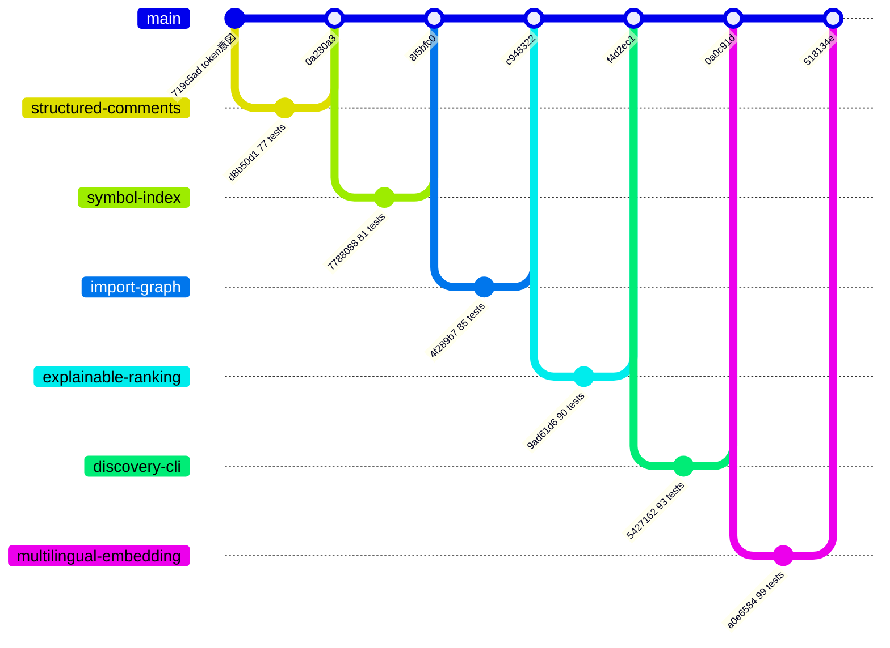

| 段階 | Feature branch | Feature commit | Main merge | 到達した検証 |
|---|---|---|---|---|
| 構造化file comment | `feature/structured-file-comments` | `d8b50d1` | `0a280a3` | 77 tests、全build |
| symbol・comment索引 | `feature/symbol-comment-index` | `7788088` | `8f5bfc0` | 81 tests、全build |
| import graph | `feature/import-graph` | `4f289b7` | `c948322` | 85 tests、全build |
| 説明可能なranking | `feature/explainable-ranking-core` | `9ad61d6` | `f4d2ec1` | 90 tests、全build |
| feature-discovery CLI | `feature/feature-discovery-cli` | `5427162` | `0a0c91d` | 93 tests、全build、実CLI |
| 多言語Embedding | `feature/multilingual-embedding` | `a0e6584` | `518134e` | 99 tests、全build、実CLI |

各branchでREADMEまたは`docs`も同時に更新しました。構造化commentの運用規則だけを別日に後付けせず、実装と同じcommitへ含めたのは、codeと説明の寿命を揃えるためです。

### 17.4 この段階で確定した境界

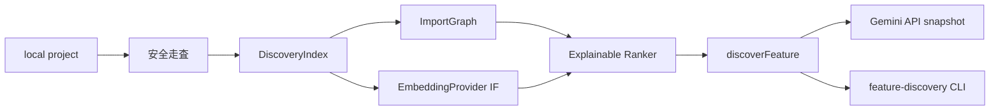

- `discovery`はAI provider、GUI、成果物形式を知らない
- `EmbeddingProvider`はvector生成だけを担い、順位の決め方を知らない
- rankerは意味類似度も特別扱いで隠さず、`semantic` evidenceとして返す
- CLIはcoreを再実装せず、引数と表示だけを担う
- Gemini API snapshotは同じ順位を利用するが、送信直前の安全検証を省略しない
- GUIの調査生成は従来どおりapplication use caseを通り、discovery CLI操作を必須にしない

この分離により、標準Embeddingを将来のローカルONNX modelへ交換する、別製品としてdiscovery CLIを配布する、GUIへ候補根拠の表示を追加するといった拡張を、秘密情報検証やbundle生成から独立して進められます。
