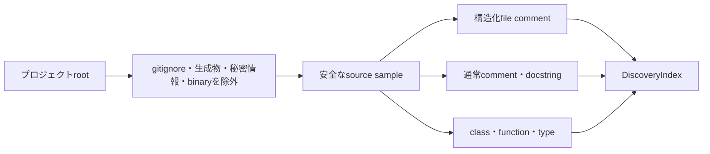

# ローカル機能探索

## 目的

ローカル機能探索は、コード全文を最初から外部AIへ渡さず、PC内で「どのファイルが指定機能に関係しそうか」を絞るためのcoreです。

現在の段階では、安全なファイル走査、構造化コメント、通常コメント、シンボルの索引を提供します。今後、importグラフ、根拠付き順位付け、CLI、多言語Embeddingを同じcoreへ追加します。



## 索引に入る情報

ファイルごとに次を保持します。

| 情報 | 用途 |
|---|---|
| project相対path・size・language | 基本的な候補判定 |
| 先頭sample | 後続のimport解析と文字列検索 |
| 構造化comment | 機能、責務、入口、flow、関連、注意点 |
| 通常comment・docstring | 人が書いた意味情報 |
| class、function、interface、typeなど | 機能名とcode上の入口を対応付ける |
| truncated | sampleがfile全体か先頭だけかを明示する |

これはASTの完全な代替ではありません。複数言語へ共通に適用できる軽量な候補生成です。最終的なコード収集前には、既存coreが実path、`.gitignore`、秘密情報をもう一度検証します。

## 安全性

- rootと各subdirectoryの`.gitignore`を評価
- `.git`、`.feature-context`、`node_modules`、`dist`、`build`、`coverage`を組み込み除外
- `.env`、秘密鍵、binary、symbolic link、代表的な埋め込みsecretを除外
- 外部AIへの送信は行わない
- 既定で最大25,000ファイル、合計256MiB、1ファイル先頭256KiBまで
- 上限へ達した場合は警告へ記録

`.feature-context`は対象projectの`.gitignore`に書かれていなくても除外します。過去に生成したbundleを次回の探索やAPI入力へ戻さないためです。

## 公開IF

```ts
const index = await buildDiscoveryIndex(
  projectRoot,
  {
    maxFiles: 25_000,
    maxScanBytes: 256 * 1024 * 1024,
    maxFileBytes: 256 * 1024
  },
  abortSignal
);
```

`DiscoveryIndex`はproject root、索引済みファイル、実走査件数、読み取りbyte、警告を返します。後続処理はファイルシステムを再走査せず、この共通索引を利用します。
