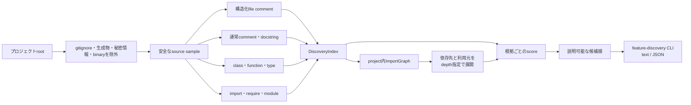
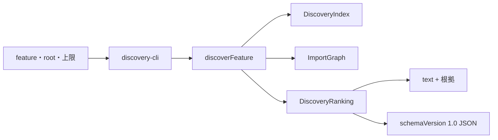

# ローカル機能探索

## 目的

ローカル機能探索は、コード全文を最初から外部AIへ渡さず、PC内で「どのファイルが指定機能に関係しそうか」を絞るためのcoreです。

現在の段階では、安全なファイル走査、構造化コメント、通常コメント、シンボルの索引、project内importグラフ、根拠付き順位付け、同じcoreを直接利用する薄いCLIを提供します。次の段階で多言語Embeddingを同じcoreへ追加します。



## 索引に入る情報

ファイルごとに次を保持します。

| 情報 | 用途 |
|---|---|
| project相対path・size・language | 基本的な候補判定 |
| 先頭sample | 後続のimport解析と文字列検索 |
| 構造化comment | 機能、責務、入口、flow、関連、注意点 |
| 通常comment・docstring | 人が書いた意味情報 |
| class、function、interface、typeなど | 機能名とcode上の入口を対応付ける |
| import、require、module参照 | project内の依存先と利用元をたどる |
| truncated | sampleがfile全体か先頭だけかを明示する |

これはASTの完全な代替ではありません。複数言語へ共通に適用できる軽量な候補生成です。最終的なコード収集前には、既存coreが実path、`.gitignore`、秘密情報をもう一度検証します。

## 安全性

- rootと各subdirectoryの`.gitignore`を評価
- `.git`、`.feature-context`、`node_modules`、`dist`、`build`、`coverage`を組み込み除外
- `.env`、秘密鍵、binary、symbolic link、代表的な埋め込みsecretを除外
- 外部AIへの送信は行わない
- 既定で最大25,000ファイル、合計256MiB、1ファイル先頭256KiBまで
- 上限へ達した場合は警告へ記録

`.feature-context`は対象projectの`.gitignore`に書かれていなくても除外します。過去に生成したbundleを次回の探索やAPI入力へ戻さないためです。

## 公開IF

```ts
const index = await buildDiscoveryIndex(
  projectRoot,
  {
    maxFiles: 25_000,
    maxScanBytes: 256 * 1024 * 1024,
    maxFileBytes: 256 * 1024
  },
  abortSignal
);
```

`DiscoveryIndex`はproject root、索引済みファイル、実走査件数、読み取りbyte、警告を返します。後続処理はファイルシステムを再走査せず、この共通索引を利用します。

## importグラフ

`buildImportGraph(index)`は索引内の参照をproject相対pathへ解決します。外部packageはedgeにせず、解決できないrelative importだけを診断情報として保持します。

```ts
const graph = buildImportGraph(index);
const related = expandImportGraph(graph, ["src/pages/LoginPage.tsx"], {
  maxDepth: 2,
  directions: ["dependency", "dependent"]
});
```

- `dependency`: 対象fileがimportしている側
- `dependent`: 対象fileをimportしている側
- cycleはvisited setで止める
- 同じdepthではpath順で決定的に処理する
- TypeScript/JavaScriptはrelative path、拡張子差、`index`を解決する
- Python relative module、Goの自module、Rustの`mod`/`crate`、Java package、C# namespaceも軽量解決する

tsconfig path alias、webpack alias、動的に組み立てたimport、実行時DI、reflectionは現時点では完全解決しません。誤ったedgeを推測するより、未解決として残す方針です。

## 説明可能な順位付け

`rankDiscoveryIndex(index, graph, feature)`は合計点だけでなく、加点・減点を`evidence`配列で返します。

| 根拠 | 基本点 | 意味 |
|---|---:|---|
| 構造化commentの`@feature` | 300 | fileが宣言した機能 |
| path | 220 | file・directory名 |
| symbol | 190 | class、function、type名 |
| `@role` | 170 | fileの責務 |
| `@entry`、`@related`、`@flow` | 150 | 入口と処理関係 |
| 通常comment・docstring | 110 | 人が記述した意味 |
| import specifier | 90 | import文に現れる関連名 |
| source sample | 60 | 先頭sample内の文字列 |
| 一般的なsource directory | 50 | `src`、`app`、`api`など |
| source file | 30 | source拡張子 |
| 80KB以下 | 10 | 全体を扱いやすい |
| test file | -5 | 直接候補では軽く減点 |
| import先 | depth 1で約140 | 入口候補が依存するfile |
| 利用元 | depth 1で約110 | 入口候補を利用するfile |

元の機能語は重み1.0、同義語・関連語は0.6です。複数根拠が一致すれば合算します。全候補について、合計点は`evidence.score`の合計と必ず一致します。

```json
{
  "path": "src/services/AuthService.ts",
  "score": 382,
  "relation": "direct",
  "evidence": [
    {
      "kind": "symbol",
      "score": 114,
      "detail": "symbolが「auth」と一致"
    },
    {
      "kind": "graph-dependency",
      "score": 158,
      "detail": "LoginPageから1段のimport先"
    }
  ]
}
```

### 現在の関連語展開

認証、通知、課金、account、権限、検索、file transfer、message、設定、注文の日本語・英語辞書を内蔵しています。辞書にない語も元のqueryとして検索します。関連語辞書は決定的で説明しやすい一方、未知の表現には弱いため、後続段階で多言語Embeddingを追加します。

### Gemini APIとの接続

Gemini API用project snapshotはこの順位を使って本文を詰めます。パス一覧と各本文headerには`local_score`と上位の根拠を付けます。Geminiはローカルで選ばれた順序と理由を確認したうえで最終調査を行います。

## feature-discovery CLI

CLIは`discoverFeature(projectRoot, feature, options, signal)`をそのまま呼ぶinterface adapterです。別の探索処理やAI呼び出しを持ちません。



```powershell
node dist/node/discovery-cli/index.js "ログイン機能" --root . --max 20 --explain
node dist/node/discovery-cli/index.js "通知機能" --root . --format json
```

- `text`は候補path、score、relationを表示し、`--explain`で根拠を展開する
- `json`はquery、候補、根拠、未解決import、警告を機械可読で返す
- どちらもsource sampleやコード本文を出力しない
- ファイルを書き込まず、外部AIやネットワークを呼ばない
- SIGINT / SIGTERMを`AbortSignal`として走査へ伝える
- ファイル数、総byte、1ファイルbyteの安全上限をCLIから狭められる

`runFeatureDiscoveryCli(argv, dependencies)`は出力先、現在ディレクトリ、探索関数、`AbortSignal`を差し替えられるため、実AIやグローバルCLIを使わずにテストできます。
