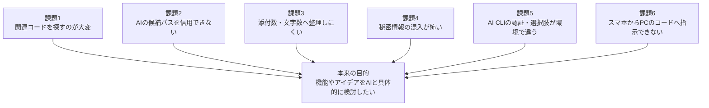
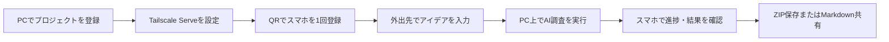

# Feature Context Builder プロダクト企画書

## 1. 一言でいうと

Feature Context Builderは、**「この機能を理解・相談するために必要なコードを集めて」と指示するだけで、AIがコードベースを調査し、安全に検証された説明と実コードを、ChatGPTへ渡しやすい最大5件のMarkdownへまとめるツール**です。

PCからもスマホからも操作できます。ソースコードを編集する道具ではなく、アイデア検討、仕様相談、修正方針の検討に必要な「正しいコードコンテキスト」を作る道具です。

## 2. この製品が必要となる背景

### 2.1 AIへ相談する前の準備が重い

ChatGPTやコーディングAIは、背景と関連コードがそろっていれば具体的な提案を返せます。しかし実際のプロジェクトでは、1つの機能が画面、状態管理、サービス、API、バックエンド、型、テストへ分散しています。

利用者が「ログイン機能について相談したい」と思っても、その前に次の作業が発生します。

1. 入口となる画面を探す
2. 呼び出しているhookやサービスをたどる
3. APIやバックエンドを探す
4. 型やテストも必要か判断する
5. 各ファイルをコピーする
6. 添付数や文字数へ収める
7. 秘密情報が入っていないか確認する

本来考えたいのは機能やアイデアなのに、相談を始めるまでの「コード発掘と荷造り」に時間がかかります。

### 2.2 コードを集める判断には既存構造の理解が必要

関連ファイルを正しく選ぶには、すでにそのコードを理解している必要があります。特に、直接関係するファイルと間接依存、中核ロジックとテスト、共有型と無関係な共通処理の境界は、単純なファイル名検索だけでは判断できません。

これは次の矛盾を生みます。

> 機能を理解するためにコードコンテキストが必要だが、正しいコードコンテキストを選ぶために機能を理解している必要がある。

### 2.3 AI CLIごとに利用条件が異なる

利用環境によっては、Gemini CLIのGoogleアカウント認証が利用できない一方、Gemini APIキーは利用できる場合があります。また、Codex CLIをすでに利用している人もいます。

1つのAIだけを前提にすると、認証や契約条件の違いがそのまま製品利用の停止要因になります。利用者に必要なのはCLIそのものではなく「コードベースを調査して共通形式で返す能力」です。

### 2.4 Gemini APIはローカルフォルダを直接見られない

CLIはプロジェクトフォルダを直接調査できますが、APIはPC内のフォルダを直接参照できません。APIを選択肢に加えるには、ローカルで安全なプロジェクト情報を作り、秘密情報や生成物を除外して送る仕組みが必要です。

### 2.5 アイデアはPCの前だけで生まれない

移動中や外出先で「この機能をこう変えたらどうか」と思っても、コードはPCにあります。スマホへリポジトリを複製したり、秘密鍵やAPIキーを置いたりするのは負担とリスクが大きくなります。

必要なのは、スマホへ開発環境を移すことではなく、**自分のPCへ安全に調査指示を送り、できた成果物をスマホで確認・保存すること**です。

### 2.6 手作業のコピーには品質と安全性の問題がある

手作業では、次が起きやすくなります。

- 必要なファイルを入れ忘れる
- 古いコードや別ファイルを貼る
- 同じコードを重複して文字数を消費する
- 途中だけコピーして文脈を壊す
- `.env`や秘密鍵を誤って含める
- なぜ選んだファイルか後から分からなくなる
- 上限へ収めるため重要ファイルを黙って捨てる

単にAIへ検索させるだけではなく、AIの回答を検証し、実ファイルから再現可能な成果物を作る必要があります。

### 2.7 これまでの検討から見えた製品の本質

製品の検討は「Gemini CLIで関連コードをまとめるPCツール」から始まりました。その後、実際の利用上の壁を追うことで、必要なものが単なるCLIの画面ではないことが明確になりました。


この流れから、プロダクトオーナー目線では次のように整理できます。

- 複数AI対応は「選択肢を増やす機能」ではなく、認証や利用条件が変わっても作業を止めないための継続性である
- スマホ対応は「小さなPC画面」ではなく、アイデアが生まれた瞬間に自分のPCへ調査を依頼する入口である
- 共通設定は単なる設定画面ではなく、APIキーをスマホへ出さずにPCとスマホをつなぐ信頼の中心である
- 成果物の価値はファイル数ではなく、選定理由、欠落理由、実コード一致まで説明できることにある

したがって、この製品の本質は特定AIのフロントエンドではなく、**アイデアと実際のコードベースの間を、安全で確認可能なコンテキストに変換する基盤**です。

## 3. 解決したい中心課題



中心課題は「AIがコードを読めないこと」だけではありません。

**正しい範囲を、安全に、説明付きで、使える大きさへ変換し、利用者が確認して持ち出せるところまでを一連の体験にすること**が課題です。

## 4. 誰のための製品か

### 4.1 主な利用者

- 自分のアプリやサービスを開発している個人開発者
- 実装詳細をAIと相談しながらプロダクトを育てたいプロダクトオーナー兼開発者
- 既存コードベースの特定機能を短時間で把握したい開発者
- 実装作業そのものより、変更案や仕様の妥当性を先に検討したい人

### 4.2 利用者が達成したいこと

```text
「通知機能を改善したい」
        ↓
通知機能の入口からバックエンド・テストまでを自動で調べる
        ↓
なぜ必要なファイルか分かる
        ↓
実コードを確認し、不要なものだけ外す
        ↓
最大5件のMarkdownまたはZIPをChatGPTへ渡す
        ↓
現在の実装に即した改善案を相談する
```

### 4.3 利用者が片付けたい仕事（Jobs to Be Done）

> 特定機能についてAIへ相談したいとき、リポジトリ全体を説明したり手作業でコードを集めたりせずに、相談に必要な実コードと構造を、安全で確認可能な添付資料として短時間で作りたい。

## 5. 課題に対する機能

| 課題 | 製品機能 | 利用者にとっての価値 |
|---|---|---|
| 関連コードが複数層へ分散している | AIへ入口、UI、状態、ドメイン、API、バックエンド、型、テストをたどらせる | 機能全体を入口から出口まで把握できる |
| AIが存在しないパスを返すことがある | 安全処理がプロジェクト内の実在パス、通常ファイル、実体パスを再検証 | AIの思い込みをそのまま成果物へ入れない |
| 直接関係と間接依存を区別しにくい | `core`、`supporting`、`test`の優先度と、役割・理由・グループ | なぜ必要かを理解しながら選べる |
| 構造を一覧しにくい | 検証済みパスから関連コードツリーを決定的に生成 | リポジトリ全体ではなく機能の形だけ見える |
| 添付数が多くなる | 調査ソース数は制限せず、最終Markdownだけ最大5件へ梱包 | 調査品質を落とさずChatGPTへ添付しやすい |
| トークン・文字数が膨らむ | 全体・1ファイル単位の上限、優先度順の梱包、概算トークン | 重要コードを優先し、上限を予測できる |
| コードがAIに改変される不安 | AIは候補選定だけ。本文はcoreが実ファイルを直接読む | 連結コードと元ファイルが一致する |
| 入らなかったファイルが分からない | overviewと管理情報へ未収録理由を記録 | 情報欠落を認識したうえで相談できる |
| 説明だけ欲しい場合とコードも欲しい場合がある | 要約とコード連結を個別にON/OFF | 目的と送信量を調整できる |
| AIの選定を修正したい | チェックボックスで収録・除外し、AIなしで成果物を再構築 | 待ち時間とAPI/CLI利用を増やさず人が最終判断できる |
| Gemini CLI認証が使えない環境がある | Gemini CLI、Gemini API、Codex CLIをGUI/CLIで選択 | 利用環境に合う手段を選べる |
| Gemini APIはローカルフォルダを見られない | 安全なプロジェクト情報と構造化出力 | APIでもローカルコード調査を実現できる |
| 秘密情報を誤添付しやすい | `.gitignore`、秘密情報パス、バイナリ、埋め込み認証情報の検査 | 共有前のリスクを下げる |
| 外出先から調査を始められない | Tailscale経由のスマホPWA、進捗、キャンセル、プレビュー、ZIP | PCへ戻る前に調査と成果物確認を進められる |
| スマホへAPIキーを置きたくない | PCのWindows暗号化保存をPC/スマホ実行で共有 | 秘密情報をスマホへ配布せず利用できる |
| 任意のPCパスを遠隔操作されるのが怖い | PCで事前登録したプロジェクトIDだけをスマホへ公開 | リモート操作の範囲を限定できる |
| エラー原因が分かりにくい | 日本語の案内と展開可能な技術詳細 | 次に認証・設定・再実行のどれをすべきか判断できる |

## 6. 提供する体験

### 6.1 PCで使う


初回利用者は、フォルダと機能名を入れるだけで開始できます。詳細設定は必要なときだけ変更します。

### 6.2 スマホで使う



スマホはPCの代わりにコードを保存・解析するのではなく、PC上の処理を安全に操作するリモコンとして働きます。

### 6.3 成果物

```text
.feature-context/
└─ 機能名/
   ├─ manifest.json           ← PC内部の管理・再構築用
   └─ bundle/
      ├─ 01-overview.md       ← ツリー、理由、処理フロー、警告
      ├─ 02-frontend.md       ← 必要な場合だけ実コード
      ├─ 03-backend.md
      ├─ 04-shared.md
      └─ 05-tests.md
```

調査対象ソースは5件に限定しません。必要なソースをすべて候補・検証した後、添付用成果物だけを指定件数、最大5件へ整理します。

## 7. 製品としての価値

### 7.1 時間を短縮する

手作業の「検索、追跡、コピー、整形、圧縮」を、機能名から一連で実行します。特に初見機能や層の多い機能ほど効果が大きくなります。

### 7.2 AIとの会話の質を上げる

単なるファイルの寄せ集めではなく、入口、処理フロー、各ファイルの役割・理由、警告、不明点を添えます。ChatGPTは「何のコードか」を理解しやすくなり、利用者もAIの選定を確認できます。

### 7.3 人の最終判断を残す

AIへ丸投げせず、利用者がプレビューし、ソースの収録・除外を変更できます。AIによる広い探索と、人によるプロダクト判断を分担します。

### 7.4 ローカルコードを扱うリスクを下げる

AIのパスを信用せず、秘密情報を除外し、リモート公開範囲を登録プロジェクトへ限定します。安全を完全に保証するものではありませんが、手作業より一貫した確認を行えます。

### 7.5 1つのAIへロックインしない

利用者が必要なのは「機能調査結果」です。Gemini CLI、Gemini API、Codex CLIを共通形式へ変換することで、認証状況、料金、利用可能なツールに応じて選べます。

## 8. この製品の特徴

一般的なAIコーディングツールとの違いは、コードを生成・修正することではなく、**別のAIへ相談するための高品質なコンテキストを作ること**へ集中している点です。

| 観点 | Feature Context Builder |
|---|---|
| 主目的 | 機能単位の相談資料を作る |
| AIの役割 | 関連範囲の探索、役割・理由・処理フローの説明 |
| 安全処理の役割 | パス検証、実コード収集、安全確認、決定的な梱包 |
| 人の役割 | 調査目的の入力、成果物プレビュー、最終ソース選択 |
| 出力 | 説明付きMarkdown最大5件、内部管理情報、スマホ用ZIP |
| コード変更 | 行わない |
| リモート利用 | Tailscale内だけ。登録済みプロジェクト限定 |

## 9. プロダクト原則

今後の機能判断でも、次の原則を優先します。

1. **調査対象ソース数と添付成果物数を混同しない**
   広く調べ、狭く分かりやすくまとめます。

2. **AIの回答を信頼境界の外に置く**
   パス、JSON、優先度、コード本文を安全処理側で検証します。

3. **コード本文は実ファイルを正とする**
   AIへコードを再生成させません。

4. **利用者が送信前に確認できる**
   プレビュー、警告、未収録理由、ソース再選択を維持します。

5. **PCとスマホで同じ安全処理を使う**
   入口によって安全性や成果物品質を変えません。

6. **秘密情報は必要なプロセスから出さない**
   APIキーをスマホやPC画面へ配布しません。

7. **ローカルファーストを維持する**
   クラウド保存や一般公開を前提にしません。

8. **非技術者にも次の操作が分かる**
   通常画面は日本語の原因と対処を優先し、詳細ログは必要な人だけ開きます。

## 10. 成功を判断する指標

利用状況をクラウドへ収集しない前提のため、まずは利用者自身が確認できる指標を重視します。

| 指標 | 望ましい状態 |
|---|---|
| 調査開始までの操作 | フォルダ選択、機能入力、生成の3段階で開始できる |
| 調査から成果物まで | 手作業でファイルを探してコピーするより短い |
| 成果物件数 | 常に設定上限以内、最大5件 |
| コード整合性 | 収録コードが元ファイルと一致する |
| 説明可能性 | 全関連ファイルに役割と選定理由がある |
| 欠落の可視性 | 未収録ファイルに理由がある |
| 再調整の負担 | AIを再実行せず成果物だけ変更できる |
| リモート安全性 | 未登録プロジェクトや未認証端末から操作できない |
| AIの可用性 | 1つのCLIが使えなくても別のAIを選べる |
| 品質確認 | テスト、型チェック、ビルド、Electron起動確認が成功する |

## 11. 制約とリスク

- 調査品質は選択したAI、モデル、認証、リポジトリ構造に依存する
- 秘密情報検出は代表的形式を対象とし、難読化や独自形式を完全には検出できない
- Gemini API利用時は、除外・検査後のコードコンテキストがGoogleへ送信される
- 大規模リポジトリではAPI送信量上限によりCLIより調査精度が下がる場合がある
- スマホ連携にはPCの電源、ネットワーク、アプリ、Tailscaleの稼働が必要
- PCがスリープしている場合はスマホから起こせない
- スマホジョブ履歴はメモリ内で、アプリ終了後は消える
- 最終成果物は送信前に利用者が確認する必要がある

これらは画面、README、内部管理情報の警告で隠さず伝える必要があります。

## 12. 現在の製品範囲

実装する範囲:

- 単一利用者のローカルPC
- PC GUI、スマホPWA、CLI
- Gemini CLI、Gemini API、Codex CLI
- 機能調査、安全なソース検証、要約、コード連結
- 最大5件のMarkdown、内部管理情報、ZIP
- プレビュー、キャンセル、ソース再選択、AIなしの再構築
- Tailscale経由の非公開リモート操作

意図的に実装しない範囲:

- 外部開発者が任意プラグインをインストールする仕組み
- 複数ユーザー・権限管理
- クラウド分散実行
- 複数PC間のジョブ共有
- 外部プラグインを安全なサンドボックスで動かす仕組み
- Chrome拡張やChatGPT画面の自動操作
- ChatGPTへの自動送信、OpenAI API連携
- クラウドへの成果物保存
- ソースコードの編集・自動修正

この境界により、製品は「自分のPCにあるコードを、自分がAIへ相談するために安全にまとめる」という中心価値へ集中できます。

## 13. まとめ

Feature Context Builderが解決するのは、単なるファイル検索ではありません。


AIが探索し、PC内の安全処理が検証し、人が最終確認する。この役割分担によって、アイデアから具体的なコードの議論へ進むまでの摩擦を減らすことが、この製品の中心価値です。
